# 📱 Mobile App Developer | iOS & Android Specialist

<div align="center">
  
[](https://www.upwork.com/freelancers/~01a078b9f2a2be910a)
[](https://www.upwork.com/freelancers/~01a078b9f2a2be910a)
[](https://www.upwork.com/freelancers/~01a078b9f2a2be910a)
[](https://www.upwork.com/freelancers/~01a078b9f2a2be910a)
[](https://www.upwork.com/freelancers/~01a078b9f2a2be910a)

### 💰 **$80/hr** | 🇺🇸 US-Based | 🚀 Full-Stack Mobile Solutions

[](https://www.upwork.com/freelancers/~01a078b9f2a2be910a)

</div>

---

## 👨‍💻 About Me

I'm a **senior mobile app developer** specializing in building high-performance, scalable mobile applications for startups and enterprises. From concept to App Store deployment, I deliver complete mobile solutions with clean architecture and seamless user experiences.

🎯 **What Sets Me Apart:**
- End-to-end mobile app development (UI/UX → Deployment)
- Cross-platform expertise (React Native & Flutter)
- Production apps with millions of users
- Clean, maintainable, and scalable code architecture
- Fast iterations with clear communication

---

## 🛠️ Tech Stack & Expertise

### **Mobile Development**
<div>
  


</div>

### **Backend & Cloud**
<div>
  


</div>

### **AI & Integrations**
<div>
  


</div>

### **Development Tools**
<div>
  


</div>

---

## 🎯 Core Services

### 📱 **Cross-Platform App Development**
- ⚛️ React Native development for fast, scalable apps
- 🎨 Flutter development with smooth UI and pixel-perfect animations
- 🔄 iOS + Android with native integrations and optimal performance

### ☁️ **Backend & Cloud Infrastructure**
- 🔥 Firebase (Auth, Firestore, Functions, Storage, Analytics)
- ⚡ Supabase for real-time PostgreSQL backends
- 🌐 Node.js REST APIs with Express
- 🔔 Real-time sync, offline mode, and push notifications

### 🤖 **AI, Chat & Automation**
- 🧠 OpenAI & ChatGPT integrations
- 💬 AI-powered chat applications
- 🔄 Smart automation flows and recommendations
- 🎯 Base44 & Lovable integrations

### 💳 **Payments & Authentication**
- 💰 Stripe, Apple Pay, Google Pay implementation
- 🔐 Secure OAuth and JWT authentication flows
- 📅 Subscription management with webhooks
- 🛡️ PCI-compliant payment processing

### 🎨 **UI/UX Implementation**
- 🖼️ Figma-to-mobile app conversion
- 📱 Responsive, clean, and accessible design
- ✨ Smooth animations and micro-interactions
- ♿ WCAG accessibility compliance

---

## 🏆 Featured Mobile Apps Portfolio

### 🚖 **Bolt – Request a Ride**
`React Native` `Kotlin` `Real-time GPS` `Payment Integration`
- Ride-hailing platform with real-time driver tracking
- Secure payment processing and ride history
- High-performance mapping and location services

### 👶 **Sitly – Babysitting App**
`React Native` `Firebase` `Chat` `Booking System`
- Connects parents with trusted babysitters
- In-app messaging and scheduling
- Profile verification and rating system

### 📊 **Deputy – Workforce Scheduling**
`Firebase` `React Native` `Enterprise Scale`
- Employee scheduling and time tracking
- Shift management and notifications
- Enterprise-grade security and compliance

### 📺 **BritBox – British TV Streaming**
`Flutter` `Video Streaming` `DRM` `Offline Mode`
- Premium video streaming platform
- Secure content delivery with DRM
- Offline downloads and playback

### 💼 **SEEK Jobs**
`React Native` `High-Scale Architecture` `Complex State Management`
- Australia's leading job search platform
- Advanced filtering and recommendation engine
- Optimized for millions of active users

### 📋 **Taskport – Organizer App**
`Real-time Sync` `Push Notifications` `Offline First`
- Task management with team collaboration
- Real-time updates across devices
- Smart reminders and productivity analytics

### 💪 **Forever Young Workout**
`Flutter` `Video Streaming` `In-App Purchases`
- Fitness video streaming platform
- Workout tracking and progress analytics
- Subscription-based monetization

### 💬 **ChatWise – AI Social App**
`OpenAI` `Firebase` `Real-time Chat` `AI Integration`
- AI-powered social networking platform
- Smart conversation suggestions
- Real-time messaging with AI assistance

---

## 💼 What You Get

```typescript
const deliverables = {
  development: [
    "Full mobile app (frontend + backend)",
    "Clean, modular TypeScript architecture",
    "Optimized performance & smooth animations",
    "Comprehensive documentation"
  ],
  communication: [
    "Daily progress updates",
    "Fast iterations & feedback loops",
    "Clear technical explanations",
    "Proactive problem-solving"
  ],
  deployment: [
    "App Store submission & approval",
    "Google Play publishing",
    "CI/CD pipeline setup",
    "Post-launch support"
  ]
};
```

---

## 🚀 My Development Process

```mermaid
graph LR
    A[📋 Requirements] --> B[🎨 UI/UX Design]
    B --> C[⚙️ Architecture]
    C --> D[💻 Development]
    D --> E[🧪 Testing]
    E --> F[🚀 Deployment]
    F --> G[📈 Monitoring]
```



1. **Discovery & Planning** - Understanding your vision and technical requirements
2. **Architecture Design** - Scalable, maintainable code structure
3. **Iterative Development** - Agile sprints with regular demos
4. **Quality Assurance** - Comprehensive testing (unit, integration, E2E)
5. **Deployment** - App Store & Play Store publishing
6. **Post-Launch Support** - Monitoring, updates, and optimizations

---

## 📊 GitHub Stats

<div align="center">
  


</div>

---

## 🤝 Let's Build Something Amazing

I'm always excited to work on innovative mobile app projects. Whether you're a startup with an MVP or an enterprise needing a robust mobile solution, I can help bring your vision to life.

### 📬 Get In Touch

<div align="center">

[](https://www.upwork.com/freelancers/~01a078b9f2a2be910a)
[](mailto:your.email@example.com)
[](https://linkedin.com/in/yourprofile)
[](https://yourportfolio.com)
[](https://twitter.com/yourhandle)

</div>

---

### 💡 Quick Start Consultation

Before we begin, I offer a **free 15-minute consultation** to:
- ✅ Review your app requirements
- ✅ Discuss technical approach and timeline
- ✅ Provide initial architecture recommendations
- ✅ Answer any questions about the development process

---

<div align="center">

### ⭐ If you find my work valuable, please star this repository!

**💰 Rate:** $80/hour | **📍 Location:** United States | **⚡ Response Time:** < 2 hours

---

*"Clean code, scalable architecture, and exceptional user experiences - delivered."*

[](https://github.com/yourusername)

</div>
